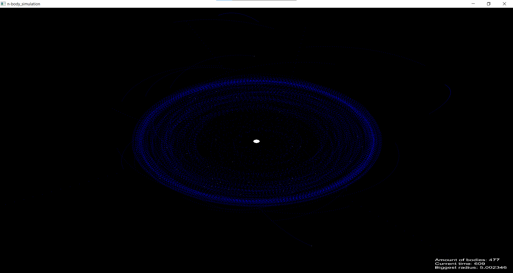
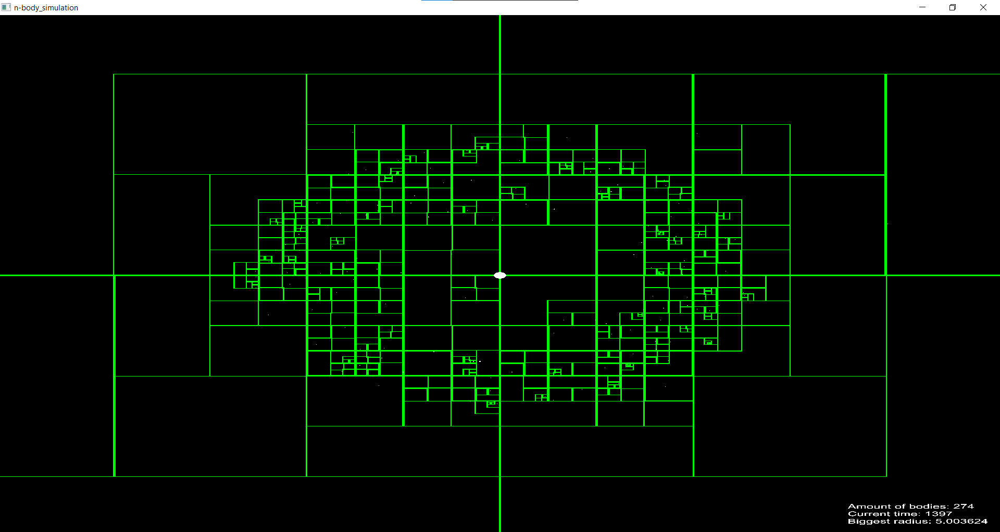

<h1>N-Body Simulation Project in C++ </h1>
The project written in C++ called n-body simulation allows for advanced simulation of the motion and interaction of any finite number of bodies in a gravitational field, where each body interacts with every other.

<h2>Visualization</h2>
A two-dimensional visualization (projection from the Z-axis) is implemented using the SFML library. Bodies are represented by circles. It is possible to draw an octree, orbits, hide text, and pause/resume the simulation. Saving to/from a file is available using additional arguments when running the program.

<h2>Barnes-Hut Algorithm</h2>
A key element of the project is the application of the Barnes-Hut algorithm to reduce computational complexity (the naive method of calculating forces between each pair of bodies is of course O(n^2)). The applied algorithm has an average complexity of O(n*log(n)) which significantly speeds up the simulation and allows it to be run for systems with many thousands of bodies. Collision handling (not increasing complexity) and escapes of bodies beyond the gravitational field have also been implemented.

This algorithm recursively divides our n-bodies into groups, which are stored in a structure called an octree. Each node represents a region of three-dimensional space and a group of bodies located therein. A characteristic feature of this tree is that individual bodies occur in the leaves, and in the internal nodes groups of bodies represented by their centers of mass.

To calculate the force acting on a specific body, the nodes of the tree are reviewed starting from the root. If the center of mass of the internal node is far enough from the body, the bodies contained in this part of the tree are treated as a single particle, whose position and mass are respectively the center of mass and the total mass of the internal node. If the internal node is close enough to the body, the process is repeated for each of its children.

Whether a node is or is not far enough from the body depends on the ratio s/d, where s is the width of the region represented by the internal node, and d is the distance between the body and the center of mass of the node. The node is far enough away when this ratio is less than the threshold value θ. The parameter θ determines the accuracy of the simulation; larger values of θ increase the speed of the simulation, but decrease its accuracy (in the project θ = 0.5 was used for space with a number of bodies below 1000 and appropriately scaled for those with a larger number to speed up the simulation). Note that for θ = 0 the algorithm turns into brute-force.
<h3> Orbits </h3>

<h3> Octree </h3>

